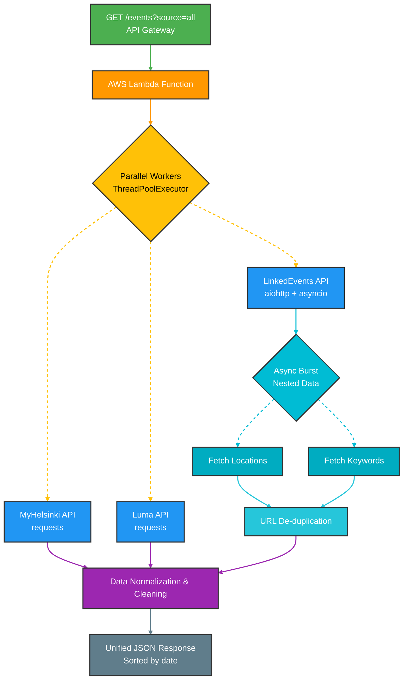

# Helsinki Event Aggregator (High-Performance AWS Lambda API)

This project is a **serverless API Orchestrator** that aggregates, normalizes, and serves event data from major Helsinki sources in real-time. By utilizing a **hybrid multi-threaded and asynchronous architecture**, it processes hundreds of data points from MyHelsinki, Luma, and LinkedEvents in seconds.

---

## Technical Highlights

- **Hybrid Concurrency:** Combines `ThreadPoolExecutor` for standard REST APIs with `asyncio` and `aiohttp` for complex, nested data fetching.
- **Performance Optimization:** Reduced execution time for LinkedEvents from 60+ seconds to under 5 seconds by implementing parallel request pooling and URL de-duplication.
- **Data Normalization:** Maps inconsistent schemas from three different providers into a single, clean JSON format for frontend consumption.
- **DevOps Pipeline:** Fully automated CI/CD using GitHub Actions, handling environment builds, dependency zipping, and AWS Lambda deployment.

---

## Tech Stack

- **Runtime:** Python 3.9
- **Core Libraries:** `aiohttp`, `asyncio`, `requests`, `concurrent.futures`
- **Infrastructure:** AWS Lambda, IAM, API Gateway
- **CI/CD:** GitHub Actions

---

## Architecture Overview

The Lambda function acts as a central hub. When a request hits the API Gateway, the function:

1. Identifies the requested sources via query parameters.
2. Triggers parallel workers to scrape external APIs.
3. Performs an **Async Burst** for LinkedEvents to fetch deep-linked location and keyword data.
4. Returns a unified, sorted list of events.



---

## API Usage

**Endpoint:** `GET /events?source=all`

| Parameter | Values | Description |
|:----------|:-------|:------------|
| `source`  | `myhelsinki`, `luma`, `linked_events`, `all` | Filter by event source. Defaults to `all`. |

**Response Schema:**

```json
{
  "events": [
    {
      "id": "string",
      "title": "string",
      "description": "string",
      "start_time": "ISO 8601",
      "end_time": "ISO 8601",
      "location": "string",
      "url": "string",
      "source": "myhelsinki | luma | linkedevents"
    }
  ]
}
```

---

## Setup & Deployment

### 1. Clone & Initialize

```bash
git clone https://github.com/A2p3kt/helsinki-event-aggregator.git
cd helsinki-event-aggregator
python -m venv venv
source venv/bin/activate   # On macOS/Linux
venv\Scripts\activate      # On Windows
pip install -r requirements.txt
```

### 2. Run Locally

You can test the handler logic directly before deploying to the cloud.

```python
# example local test
from lambda_function import lambda_handler
result = lambda_handler({"source": "all"}, None)
print(result)
```

### 3. CI/CD Secrets

To enable automated deployment, add the following to your **GitHub Repository Secrets**:

> [!IMPORTANT]
>
> `AWS_ACCESS_KEY_ID`, `AWS_SECRET_ACCESS_KEY`, and `AWS_REGION` must all be set before the pipeline can deploy successfully.

---

## CI/CD Pipeline

The deployment process is fully automated via GitHub Actions. The `.github/workflows/deploy.yml` workflow handles:


| Step | Description |
| :----- | :------------ |
| **Dependency Management** | Installs libraries from `requirements.txt` into the build environment |
| **Packaging** | Creates a deployment ZIP file compatible with the AWS Lambda runtime |
| **Deployment** | Updates the Lambda function code using credentials stored in GitHub Secrets |
