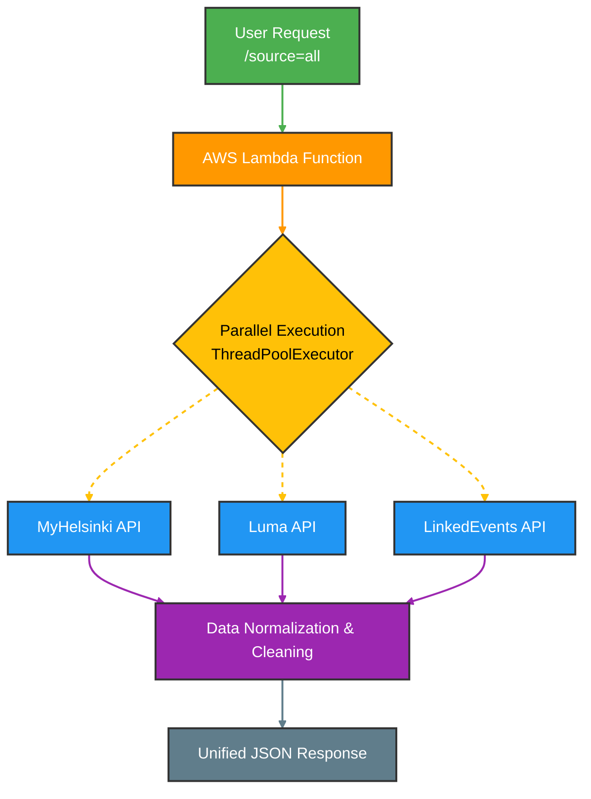

# Helsinki Event Aggregator (AWS Lambda + CI/CD)

This project is a **serverless API Orchestrator** designed to aggregate, normalize, and serve event data from multiple Helsinki-based sources in parallel. It is built to demonstrate high-performance data fetching and modern DevOps practices using **AWS Lambda** and **GitHub Actions**.

---

## Key Features

- **Parallel Execution:** Uses `ThreadPoolExecutor` to fetch data from multiple sources (MyHelsinki, Luma, LinkedEvents) simultaneously, reducing total API latency.
- **Data Normalization:** Converts inconsistent data formats from various third-party APIs into a unified JSON schema.
- **Serverless Architecture:** Deployed as a scalable AWS Lambda function, optimized for cost and performance.
- **Automated CI/CD:** Integrated with GitHub Actions to automatically build, package, and deploy code updates to AWS upon every push to `main`.

---

## Tech Stack

- **Language:** Python
- **Cloud Provider:** AWS (Lambda, IAM)
- **DevOps:** GitHub Actions
- **Libraries:** `requests`, `concurrent.futures`, `json`

---

## Architecture Overview



---

## Local Setup

### 1. Clone the Repository

```bash
git clone https://github.com/A2p3kt/helsinki-event-aggregator.git
cd helsinki-event-aggregator
```

### 2. Initialize Environment

```bash
python -m venv venv
source venv/bin/activate   # On macOS/Linux
venv\Scripts\activate      # On Windows
pip install -r requirements.txt
```

### 3. Run Locally

You can test the logic by invoking the handler functions directly within a local script before deploying to the cloud.

```python
# example local test
from lambda_function import lambda_handler
result = lambda_handler({"source": "all"}, None)
print(result)
```

---

## CI/CD Pipeline

The deployment process is fully automated via GitHub Actions. The `.github/workflows/deploy.yml` workflow handles:

```mermaid
graph LR
    A[Push to main] --> B[GitHub Actions Triggered]
    B --> C[Install Dependencies<br/>from requirements.txt]
    C --> D[Package into<br/>Deployment ZIP]
    D --> E[Deploy to AWS Lambda<br/>via GitHub Secrets]
    E --> F[Live Function Updated]

    style A fill:#4CAF50,stroke:#333,stroke-width:2px,color:#fff
    style B fill:#24292e,stroke:#333,stroke-width:2px,color:#fff
    style C fill:#2196F3,stroke:#333,stroke-width:2px,color:#fff
    style D fill:#FF9800,stroke:#333,stroke-width:2px,color:#fff
    style E fill:#FFC107,stroke:#333,stroke-width:2px,color:#000
    style F fill:#607D8B,stroke:#333,stroke-width:2px,color:#fff

    linkStyle 0 stroke:#4CAF50,stroke-width:2px
    linkStyle 1 stroke:#24292e,stroke-width:2px
    linkStyle 2 stroke:#2196F3,stroke-width:2px
    linkStyle 3 stroke:#FF9800,stroke-width:2px
    linkStyle 4 stroke:#FFC107,stroke-width:2px
```



### Pipeline Steps

| Step | Description |
| :----- | :------------ |
| **Dependency Management** | Installs libraries from `requirements.txt` into the build environment |
| **Packaging** | Creates a deployment ZIP file compatible with the AWS Lambda runtime |
| **Deployment** | Updates the Lambda function code using credentials stored in GitHub Secrets |

> [!IMPORTANT]
>
> Before the pipeline can deploy, you must add `AWS_ACCESS_KEY_ID`, `AWS_SECRET_ACCESS_KEY`, and `AWS_REGION` to your repository's GitHub Secrets.

---

## Unified JSON Schema

All sources are normalized into a consistent response format:

```json
{
  "events": [
    {
      "id": "string",
      "title": "string",
      "description": "string",
      "start_time": "ISO 8601",
      "end_time": "ISO 8601",
      "location": "string",
      "url": "string",
      "source": "myhelsinki | luma | linkedevents"
    }
  ]
}
```
